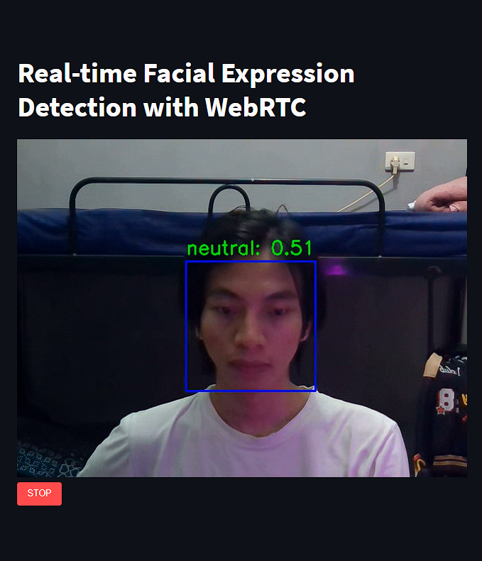

# Real-time Facial Expression Detection with WebRTC

Deskripsi:
Proyek ini bertujuan untuk mengembangkan sebuah model deteksi ekspresi wajah berbasis web yang mampu mengenali dan mengklasifikasikan ekspresi wajah manusia, seperti senang, sedih, marah, kaget, dll. Proyek ini menggunakan teknik pemrosesan gambar dan pembelajaran mendalam dengan memanfaatkan Convolutional Neural Network (CNN) sebagai arsitektur modelnya. Dataset yang digunakan bersumber dari kaggle yang di-upload oleh JONATHAN OHEIX.

Link Dataset:
https://www.kaggle.com/datasets/jonathanoheix/face-expression-recognition-dataset.

# Demo

